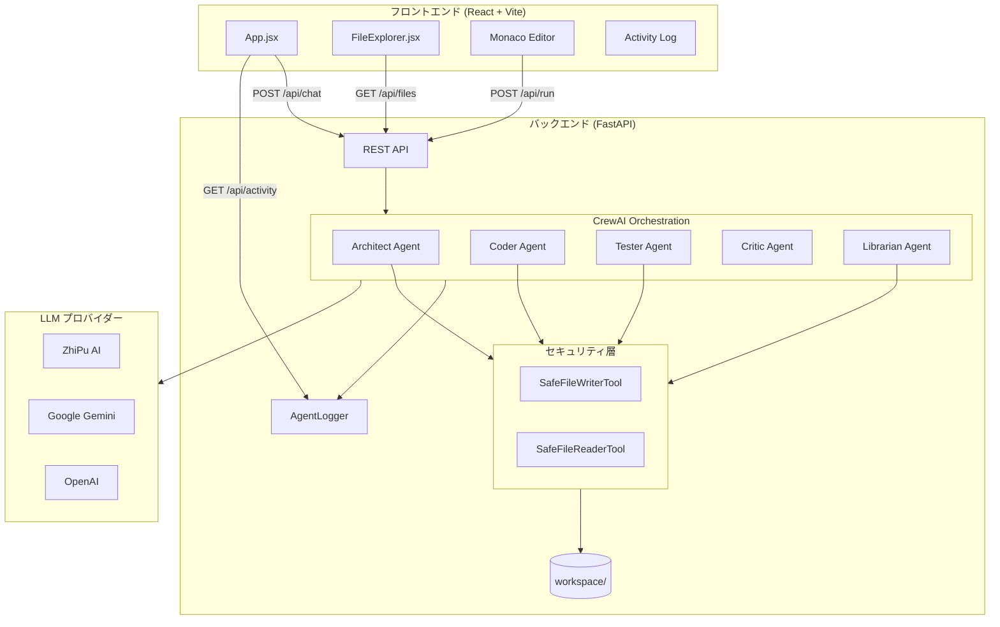
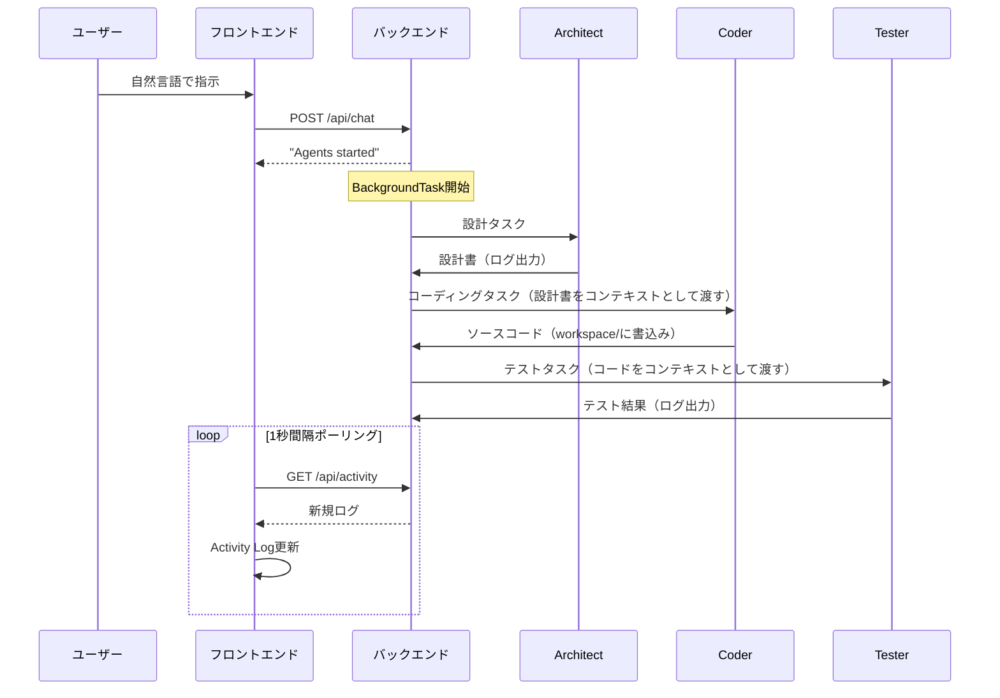
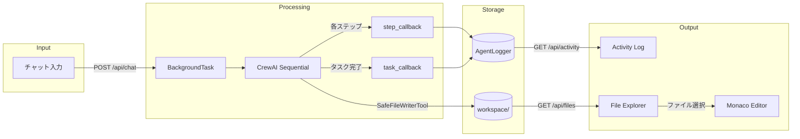

# Multi-Agent IDE — Project Architecture

> **最終更新**: 2026-02-18  
> **ステータス**: Phase 2 完了、Phase 3 計画中

---

## 1. 開発理念（Development Philosophy）

### 1.1 ビジョン
**「自然言語だけでソフトウェアを作る」**

Multi-Agent IDE は、プログラミング経験の有無に関わらず、自然言語で要件を伝えるだけでソフトウェアが生成される世界を目指しています。単なるコード補完ツールではなく、**設計 → 実装 → テスト → ドキュメント**の全工程を自律的にこなす「AIチーム」として機能する IDE を構築します。

### 1.2 コアバリュー

| 原則 | 説明 |
|------|------|
| **Specialist Collaboration** | 1つの汎用AIではなく、各専門分野に特化したエージェントが協調して品質を高める |
| **Transparency** | AIの思考過程をリアルタイムで可視化し、ブラックボックス化しない |
| **Safety First** | エージェントのファイル操作をサンドボックス内に制限し、システムファイルを保護する |
| **LLM Agnostic** | 特定のLLMプロバイダーに依存せず、柔軟に切り替え可能な設計 |
| **Developer Experience** | Monaco Editor による本格的なコーディング体験を提供 |

### 1.3 開発方針
- **段階的リリース（Phased Approach）**: Phase 1（基本動作）→ Phase 2（ファイルI/O）→ Phase 3（安全性・高度機能）と段階的に機能を拡充
- **ローカルファースト**: すべてローカルで動作し、外部サービスへの依存はLLM APIのみ
- **日本語ファースト**: エージェントのプロンプト・UIともに日本語をプライマリ言語として設計

---

## 2. 設計理念（Design Philosophy）

### 2.1 マルチエージェントアーキテクチャ

従来の「1つのAIがすべてを行う」モデルではなく、**人間の開発チームを模倣した分業体制**を採用しています。

```
ユーザーの要望
      │
      ▼
┌──────────┐
│ Architect │ ← 設計・タスク分解
└────┬─────┘
     │ 設計書
     ▼
┌──────────┐
│   Coder   │ ← コード実装
└────┬─────┘
     │ ソースコード
     ▼
┌──────────┐     ┌──────────┐
│  Tester   │     │  Critic  │ ← レビュー・テスト
└────┬─────┘     └──────────┘
     │ テスト結果
     ▼
┌──────────┐
│ Librarian │ ← ドキュメント整備
└──────────┘
```

#### なぜマルチエージェントなのか？
1. **品質の向上**: コードを書くエージェントとレビューするエージェントを分離することで、自己チェックの盲点を排除
2. **専門性の深化**: 各エージェントが自身の役割に特化したプロンプトを持つため、より高品質な出力が得られる
3. **透明性**: 各エージェントの思考過程が独立して可視化され、どの段階で何が起きたかを追跡可能
4. **拡張性**: 新しい役割のエージェント（例：セキュリティ専門家）を追加するだけで機能を拡張可能

### 2.2 セキュリティ設計

エージェントのファイル操作には**サンドボックスモデル**を採用しています。

```
backend/
├── main.py          ← システムファイル（保護対象）
├── agents.py        ← システムファイル（保護対象）
├── safe_tools.py    ← セキュリティ境界の実装
└── workspace/       ← エージェントのサンドボックス（書込み可能）
    ├── example.py
    └── test_example.py
```

- **SafeFileWriterTool**: すべての書込みパスを `os.path.abspath()` で正規化し、`workspace/` 配下であることを検証
- **SafeFileReaderTool**: 同様に読み取りもワークスペース内に制限
- **パストラバーサル防御**: `../../main.py` や絶対パス指定による攻撃を検出・ブロック

### 2.3 LLM プロバイダー戦略

特定のLLMにロックインしない設計を採用しています。

```
優先順位:
1. ZhiPu AI (GLM-4.5-Flash)  ← 現在のプライマリ
2. Google Gemini              ← フォールバック
3. OpenAI                     ← CrewAI デフォルト
```

CrewAI の `LLM` クラスと OpenAI 互換 API エンドポイントを活用し、API キーの有無で自動的に最適なプロバイダーを選択します。

---

## 3. システムアーキテクチャ（System Architecture）

### 3.1 全体構成図



### 3.2 バックエンド詳細

#### テクノロジースタック

| 技術 | バージョン | 用途 |
|------|-----------|------|
| Python | 3.13+ | ランタイム |
| FastAPI | ≥0.128 | REST API サーバー |
| uvicorn | ≥0.40 | ASGI サーバー |
| CrewAI | ≥1.9.3 | エージェントオーケストレーション |
| LiteLLM | ≥1.75.3 | LLM 抽象化レイヤー |
| python-dotenv | ≥1.1.1 | 環境変数管理 |
| uv | - | パッケージマネージャー |

#### ファイル構成

```
backend/
├── main.py           # APIサーバー・エントリーポイント
│                     # - POST /api/chat     チャットメッセージ受信→エージェント起動
│                     # - GET  /api/activity  エージェントログのポーリング
│                     # - POST /api/run       Pythonコード実行
│                     # - GET  /api/files     ワークスペースファイル一覧
│                     # - GET  /api/files/:name  ファイル内容取得
│
├── agents.py         # エージェント定義
│                     # - create_agents()    LLM選択 + 5エージェント生成
│                     # - LLM優先順位ロジック
│
├── safe_tools.py     # セキュリティツール
│                     # - SafeFileWriterTool  サンドボックス書込み
│                     # - SafeFileReaderTool  サンドボックス読取り
│
├── logger.py         # ロガー
│                     # - AgentLogger        イベントログの収集・配信
│
├── .env              # 環境変数（API キー）
├── .env.example      # 環境変数テンプレート
├── pyproject.toml    # 依存関係定義
└── workspace/        # エージェント作業ディレクトリ（サンドボックス）
```

#### API エンドポイント一覧

| メソッド | パス | 説明 | 実行方式 |
|---------|------|------|---------|
| `POST` | `/api/chat` | エージェントにタスクを指示 | BackgroundTasks |
| `GET` | `/api/activity` | エージェントのログを取得（ポーリング） | 同期 |
| `POST` | `/api/run` | Pythonコードを実行 | 同期 |
| `GET` | `/api/files` | ワークスペースのファイル一覧 | 同期 |
| `GET` | `/api/files/{filename}` | ファイル内容の取得 | 同期 |

#### エージェントワークフロー



### 3.3 フロントエンド詳細

#### テクノロジースタック

| 技術 | バージョン | 用途 |
|------|-----------|------|
| React | 19.2 | UI フレームワーク |
| Vite | 7.3 | ビルドシステム |
| Monaco Editor | 4.7 | コードエディタ（VS Codeコア） |
| Axios | 1.13 | HTTP クライアント |

#### ファイル構成

```
frontend/src/
├── main.jsx                    # エントリーポイント
├── App.jsx                     # メインアプリケーション
│                               # - チャットUI
│                               # - Monaco Editor
│                               # - 出力パネル
│                               # - Activity Log
├── App.css                     # グローバルスタイル
├── index.css                   # ベーススタイル
└── components/
    ├── FileExplorer.jsx        # ファイルエクスプローラー
    └── FileExplorer.css        # ファイルエクスプローラースタイル
```

#### UIレイアウト

```
┌─────────────────────────────────────────────────────────┐
│ Multi-Agent IDE                              [Run Code] │
├────────┬──────────┬────────────────────┬────────────────┤
│ File   │ Chat     │ Monaco Editor      │ Output         │
│ Explorer│         │                    │                │
│        │ [User]   │ // code here       │ > Hello World  │
│ 📄 a.py│ [AI]     │                    │                │
│ 📄 b.py│          │                    │                │
│        │ [input]  │                    │                │
├────────┴──────────┴────────────────────┴────────────────┤
│ Agent Activity Log                                      │
│ [18:10:59] System: Starting agents...                   │
│ [18:11:01] Architect: Starting design phase...          │
│ [18:12:19] Architect: Task completed: ...               │
└─────────────────────────────────────────────────────────┘
```

### 3.4 データフロー



---

## 4. エージェント設計（Agent Design）

### 4.1 エージェント一覧

| エージェント | 役割 | ツール | 責務 |
|------------|------|--------|------|
| **Architect** | 設計者 | FileReader, FileWriter | 要件分析、ファイル構成設計、タスク分解 |
| **Coder** | 実装者 | FileReader, FileWriter | 設計に基づくコード実装、ワークスペースへの書込み |
| **Critic** | 批評者 | なし | セキュリティ脆弱性の検出、ベストプラクティス監視 |
| **Tester** | テスター | FileReader, FileWriter | テストケース作成・実行、品質保証 |
| **Librarian** | 文書管理者 | FileReader, FileWriter | README・ドキュメントの整備・更新 |

### 4.2 実行モデル

- **Sequential Process**: タスクは Architect → Coder → Tester の順に直列実行
- **コンテキスト伝搬**: 前段タスクの出力が次段タスクの `context` として自動的に渡される
- **コールバックシステム**:
  - `step_callback`: エージェントの各ステップ（思考・アクション）をリアルタイムでログ
  - `make_task_callback`: 各タスク完了時にエージェント名付きでログ出力

### 4.3 ツール安全性

```python
# 危険なパス → ブロック
writer._run(filename="../../main.py", content="hacked!")
# → "BLOCKED: Path is outside the workspace directory"

# 正常なパス → 成功
writer._run(filename="app.py", content="print('hello')")
# → "Content successfully written to workspace/app.py"
```

セキュリティ検証の仕組み：
1. すべてのパスを `os.path.abspath()` で正規化
2. 正規化後のパスが `workspace/` で始まることを検証
3. ドライブレター・先頭スラッシュを除去して相対パスに変換
4. 検証に失敗した場合は `BLOCKED` メッセージを返却（例外ではなくエージェントへのフィードバック）

---

## 5. 環境変数

| 変数名 | 必須 | 説明 |
|--------|------|------|
| `ZHIPUAI_API_KEY` | △ | ZhiPu AI API キー（推奨） |
| `GOOGLE_API_KEY` | △ | Google Gemini API キー（フォールバック） |
| `OPENAI_API_KEY` | △ | OpenAI API キー（CrewAI デフォルト） |

> **注**: 上記のうち少なくとも1つが必要です。すべて未設定の場合はデモモードで動作します。

---

## 6. 開発ロードマップ

### ✅ Phase 1: 基本機能（完了）
- チャットによる対話型コード生成
- エージェントの思考過程をリアルタイム表示
- Pythonコードの実行と結果表示
- Monaco Editor によるコード編集

### ✅ Phase 2: ファイルI/O & ワークフロー改善（完了）
- エージェント専用ワークスペースの構築
- FileReader/FileWriter ツールの導入
- フロントエンド ファイルエクスプローラー
- 複数ファイル（モジュール import 含む）の実行サポート
- CORS 設定・ダークモード統一
- LLM を Gemini → ZhiPu AI GLM-4.5-Flash に切替
- エージェント安全性改善（SafeFileWriterTool）

### 🔜 Phase 3: 高度な機能と安全性（計画中）
- **サンドボックス実行環境**: Docker / WebAssembly による安全なコード実行（現在の `exec` からの脱却）
- **プロジェクト管理**: 複数プロジェクト/セッションの保存と切り替え
- **Git 連携**: エージェントによるコミット・PR作成
- **LSP 統合**: Monaco Editor での高度な補完・エラーチェック
- **WebSocket 通信**: ポーリングからリアルタイム通信への移行
- **エージェント間通信の高度化**: 並列実行、条件分岐、ループ処理

### 🔮 Phase 4: プロダクション化（構想）
- ユーザー認証・マルチテナント
- クラウドデプロイ（Docker Compose / Kubernetes）
- エージェントのカスタマイズUI
- プラグインシステム（カスタムエージェントの追加）

---

## 7. セットアップ

### 前提条件
- Python 3.13+
- Node.js 18+
- uv（Python パッケージマネージャー）

### バックエンド起動
```bash
cd backend
cp .env.example .env
# .env にAPIキーを設定
uv sync
uv run uvicorn main:app --reload
```

### フロントエンド起動
```bash
cd frontend
npm install
npm run dev
```

### アクセス
- フロントエンド: `http://localhost:5173`
- バックエンドAPI: `http://localhost:8000`
- API ドキュメント: `http://localhost:8000/docs`